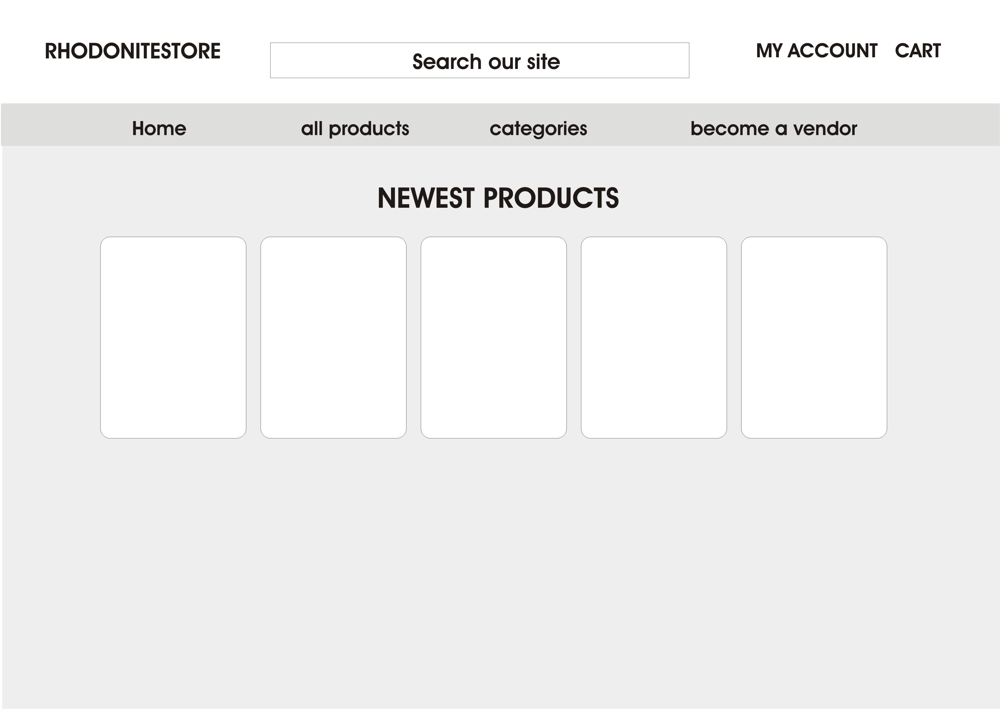
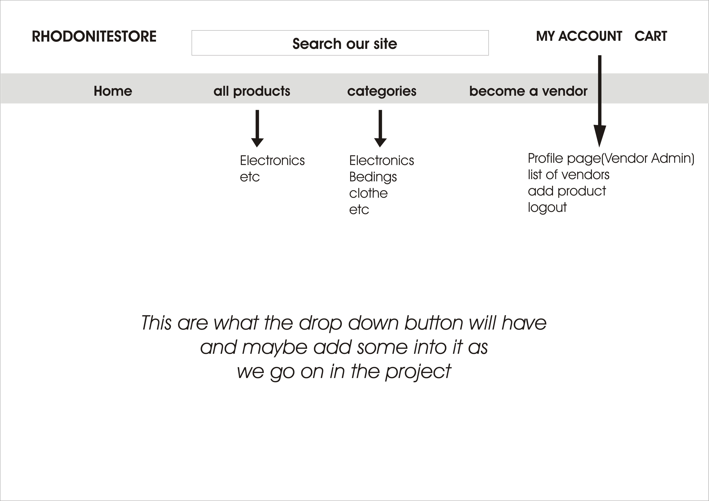
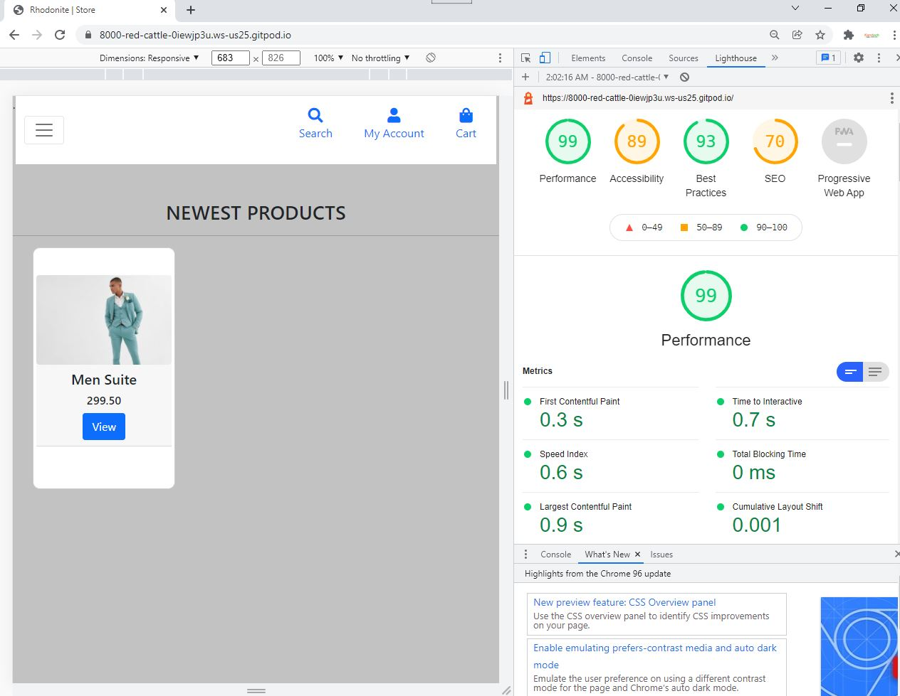
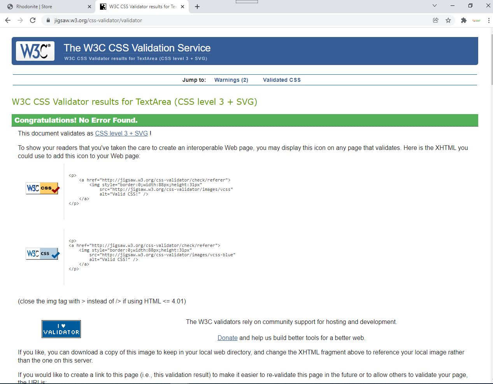

# MS4 PROJECT
## (RHODONITESTORE APP)

## Full Stack Frameworks with Django Milestone Project.

The RHODONITESTORE app is design and programmed to multi-task in which sellers are buyers can have a easy, witht he infomation right infront of them, easy clicks that takes you directly to the needed action required.
Rhodonite-store is a multi-tasking app that involves sellers (vendors as well known in the project), to register and also upload their products to the market store whereby buyers can see and make their choices of what to buy. The app is interative, friendly and easy to navigate through in and out of it.

This website/app is presented by Ochuko Erewive. A "Full stack frameworks with Django Milestone Project course in Code Institude". It a site for educational purposes.

The project is also deployed in Heroku on;
------------
#

## USER EXPERIENCE (UX)
The goal of the website is to get all information, and also see to it that all aspect is tourched as regards to the course outline. Its eductive and makes it easy for buyers to visit the site without coming back for more item to purchase, it's also built majorly for the Vendors, helping them creat an online store. Its is tested and also can be done or viewed via their phones, computer or even their tablets devices.
#
## USER STORIES

### The Acceptance Criteria: 
This is to ensure the major focus is carried out which are the following;
+ Search for a product by name or category.
+ View products by category.
+ View images and details for each product.
+ Add to cart from the detail or search pages.

Other User Stories are;
+ Make it possible to log out and log in
+ Show newest products on the frontpage
+ Show detail view of a product
+ Make it possible to add products to cart
+ Make it possible to remove product from cart
+ Make it possible to update quantity
+ Make is possible to checkout
+ Make it possible to edit vendor
+ Notify the vendor after a sale
#
## UX FRAMEWORK
1. STRATEGY
It's to create a virtual market place whereby vendors are registered and given a store which is opened and easy to view from both registered user or guest user. The website has the ability to edit, update and delete any product by the the owner of the registered account.
It's designed usinging the following programming code: HTML, CSS, JAVASCRIP, PYTHON-3 and DJANGO. The main goal is to see that all function are functioning  accordingly.

2. SCOPE
The app is interactive and allows users to input information, edit and also delete information at their discresion. This website has CRUD functionality.

The functionality requirements includes the following:
+ My Account
+ Cart
+ Search bar
+ Home
+ All Products
+ Categories
+ Become a vendor
+ List of vendors
Add product
+ Profile page(Vendor Admin)
#
3. STRACTURE
When the website is lunched, it takes you to the index page which is the home page. At the righthand side of the screen, you will fine My Account button which the drop down menu contains the login and registeration button to take you to the registeration page.
The main navbar contains the
+ Home page,
+ product,
+ category and 
+ become a vendor which links you back to the registration page.

4. SURFACE
+ Use of font awesome
+ Navigation color(grey)
+ Font color: black

## WIREFRAME
The wireframes was designed using corel-draw platforms. It can be located in a folder called "ReadmeFiles" and also it is uploaded to github for assessment.
#

#
## FEATURES
### Existing Features
1.  Structure and Navigation functionality
2.  User Authentication functionality
3.  User Interaction functionality
4.  Profile page(Vendor Admin)
5.  Uploading product and category
6.  Working Navbar
7.  Edit/Delete functionality for user
8.  Add to cart functionality
9.  Stripe payments system
10. Multiple Apps
11. Data Modeling
#
## TECHNOLOGY USED
1.  HTML5
2.  CSS
3.  JavaScript
4.  Python 3
5.  BootStrap
6.  Stripe payments
7.  Amazon

#
## TESTING
The site was tested in google chrome, mozilla and windows browsers.
# Compatibility testing
Also tested across multiple mobile devices and bowsers.
Tested on hardware devices, using Dell and Hp pcs.

# Performace testing

## Code Validation

+ W3C CSS Validator to validate CSS.

+ Nu Html Checker to test HTML.
+ Python code was validated using the ExtendsClass Python Syntax Checker with no syntax errors found.
#

# DEOLOYMENT

## Heroku Deployment

## Credits

### Content
The content was created by following the Code Institute tutorial for the Full Stack Django-Phyton project as a base, and heavily modified by myself to suit my use case

## Acknowledgements
* Code Institute group on slack
+ Tutor support team